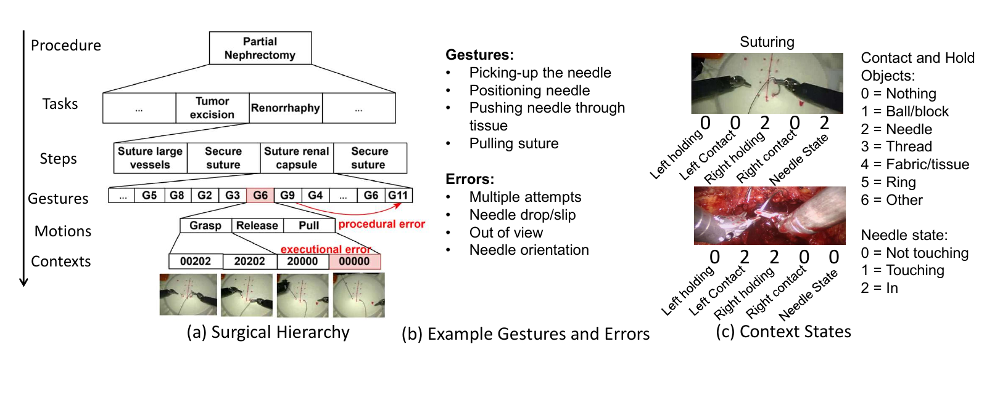
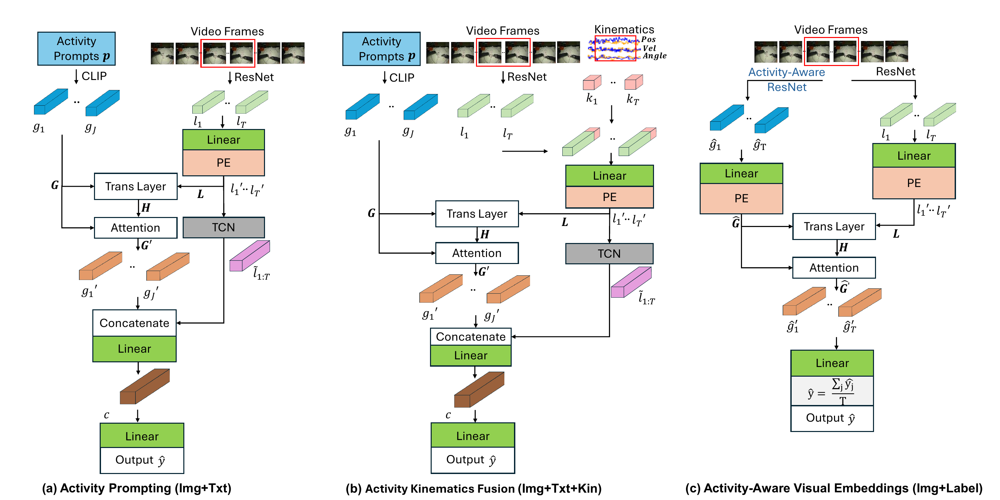
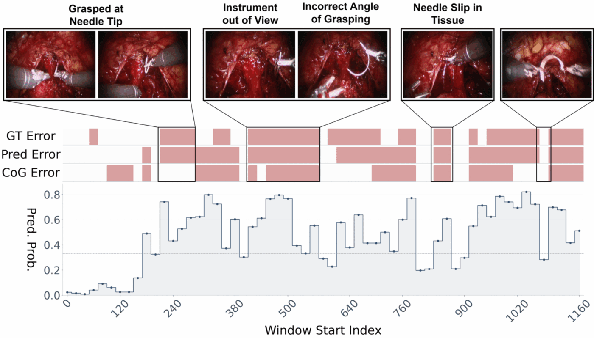

<div align="center">

# Real-Time Multimodal Activity-Aware Error Detection in Robot-Assisted Surgery

[](https://arxiv.org/abs/2606.23593)
[](https://www.python.org/)
[](https://pytorch.org/)

Official implementation of *Real-Time Multimodal Activity-Aware Error Detection in
Robot-Assisted Surgery*.

[📄 Paper](https://arxiv.org/abs/2606.23593) · [📑 Supplementary Materials](assets/supplementary_materials.pdf)

</div>

---

## Overview

Robot-assisted minimally invasive surgery improves precision but introduces complexity,
making automated detection of technical errors essential for patient safety. Existing
executional error detection methods operate almost exclusively on video, overlook
fine-grained contextual descriptions of surgical activity, and under-use complementary
modalities such as robot kinematics.

We introduce a unified framework for **real-time executional error detection** that fuses
video, kinematics, and descriptive textual prompts. Two ideas drive the approach:

- **Activity Prompting** — natural-language descriptions of gesture-level activities,
  instrument–object interactions, and error types are encoded with a CLIP text encoder and
  used to contextualize spatial visual features through cross-attention.
- **Activity-Aware Visual Embeddings** — per-frame embeddings from vision encoders
  pretrained on multi-level activity labels, used as a label-supervised alternative to
  textual prompts.

The framework improves F1 by up to **5%** on JIGSAWS and **16.6%** on SAR-RARP50 over
state-of-the-art baselines, while running end-to-end at roughly **36 ms per window**,
enabling near-30 Hz intraoperative execution.

<div align="center">

<br/>
<em>Surgical hierarchy, representative gesture and error labels, and context-state definitions.</em>
</div>

## Method

Executional errors occur at fine levels of the surgical hierarchy, appearing as anomalies in
motion sequences or context-state transitions. We therefore encode surgical knowledge at
multiple levels and use it to contextualize spatiotemporal features. Three setups are
supported:

1. **Activity Prompting** (`Img+Txt`) — CLIP-encoded activity prompts serve as queries;
   frozen ResNet50 frame features serve as keys and values in a transformer encoder layer.
   A TCN-pooled summary of the input window is fused with the refined prompt embeddings so
   the prediction stays conditioned on the current visual context.
2. **Activity Kinematics Fusion** (`Img+Txt+Kin`) — per-frame kinematics (Cartesian
   position, velocity, and grasper angle for both instruments, 14-D) are projected and fused
   with the visual features before prompt contextualization. JIGSAWS only; SAR-RARP50
   provides no kinematics.
3. **Activity-Aware Visual Embeddings** (`Img+Label`) — textual prompts are replaced by
   per-frame embeddings from a ResNet50 fine-tuned on gesture or instrument–object
   interaction labels, yielding frame-level predictions that are averaged over the window.

All encoders (ResNet backbones and the CLIP text encoder) remain **frozen**; only the
attention, fusion, and prediction layers are trained, with a class-weighted binary
cross-entropy objective.

<div align="center">

<br/>
<em>Activity-aware error detection pipeline. Pos: position, Vel: velocity, Angle: grasper angle,
Img: image data, Txt: textual prompts, Kin: kinematics, Label: gesture or interaction labels.</em>
</div>

## Repository structure

```
├── jigsaws/                 # JIGSAWS pipeline (Suturing + Needle Passing)
│   ├── train_eval_gvr_prompt_features.py       # (a) Activity Prompting          [Img+Txt]
│   ├── train_eval_gvr_kin_features.py          # (b) Activity Kinematics Fusion  [Img+Txt+Kin]
│   ├── train_eval_cross_ges_or_ctx_features.py # (c) Activity-Aware Embeddings   [Img+Label]
│   ├── model_gvr_features.py                   # model definitions for (a)/(b)/(c)
│   ├── textprompts.py                          # all JIGSAWS prompt sets
│   ├── extract_features.py                     # frozen ResNet/CLIP frame features
│   ├── extract_surgvlp_features_jigsaws.py     # SurgVLP image/prompt features
│   ├── finetune_gesture_prompt_model.py        # activity-aware encoder fine-tuning
│   ├── extract_gesture_prompt_features.py      # dump fine-tuned per-frame features
│   └── dataloader_*.py, util_*.py, jigsaws_splits.py, build_jigsaws_splits.py
├── SAR_RARP/                # SAR-RARP50 pipeline (in-vivo suturing)
│   ├── train_eval_gvr_error.py                 # (a) Activity Prompting          [Img+Txt]
│   ├── train_eval_cross_ges_or_ctx.py          # (c) Activity-Aware Embeddings   [Img+Label]
│   ├── model_gvr.py, textprompt.py, util_rarp50_features.py, dataloader_rarp50_features.py
│   ├── gesture_pretrain/, context_pretrain/    # activity-aware encoder pretraining
│   └── extract_features_sar_rarp50.py, make_rarp_embed.py, finetune_sar_rarp50_error_model.py
├── baselines/
│   ├── Chain-of-Gesture/    # CoG baseline (Shao et al., RA-L 2024)
│   └── SEDMamba/            # SEDMamba baseline (Xu et al., RA-L 2024)
├── SurgVLP/                 # surgical vision-language encoder (CLIP alternative)
├── splits/                  # JIGSAWS LOSO and LOUO split definitions
├── experiments/             # search spaces and the sweep driver
├── tools/                   # log summarizers, dataset inspection, latency profiling
├── docs/                    # data preparation guide
└── data/                    # datasets and pre-extracted features (not shipped)
```

## Installation

```bash
conda env create -f environment.yaml
conda activate activity_aware
```

Or with pip (Python ≥ 3.10):

```bash
pip install -r requirements.txt
```

## Data

The `data/` directory is **not** distributed. See [docs/DATA.md](docs/DATA.md) for how to
obtain JIGSAWS (with executional error annotations) and SAR-RARP50 (with error annotations
from SEDMamba), the exact directory layout expected by the loaders, and the
feature-extraction commands.

Once raw data is in place:

```bash
python jigsaws/extract_features.py --model resnet50     # JIGSAWS frame features
python SAR_RARP/make_rarp_embed.py                      # SAR-RARP50 frame features
```

### Preprocessing and protocol

| Setting | Value |
|---|---|
| Video / kinematics rate | 5 Hz |
| Frame preprocessing | resize 240×240, center crop 224×224, ImageNet normalization |
| Kinematics | per-variable mean/std standardization |
| **Input window** | **10 samples (2 s)** |
| **Window step** | **6 samples (1.2 s)** |
| Window label | erroneous if the window contains at least one erroneous frame |
| Optimizer | AdamW, learning rate 5×10⁻⁴, batch size 64 |
| Epochs | 50 (Img+Txt), 100 (Img+Txt+Kin) |
| Encoders | frozen (ResNet50 backbones, CLIP text encoder) |

A 2-second window is short enough for granular real-time detection, yet long enough to
supply useful temporal context.

**Cross-validation.** JIGSAWS uses Leave-One-Supertrial-Out (LOSO) over 5 folds, pooling
Suturing and Needle Passing; `splits/LOUO` additionally provides the Leave-One-User-Out
protocol. SAR-RARP50 uses the provided 40/8 train/test video split, repeated across runs to
obtain means and standard deviations.

## Training and evaluation

All commands are run from the repository root.

### (a) Activity Prompting — `Img+Txt`

```bash
# JIGSAWS (LOSO, Suturing + Needle Passing pooled)
python jigsaws/train_eval_gvr_prompt_features.py \
    --model resnet50 --prompt_type gesture_error

# SAR-RARP50 (fixed 40/8 split)
python SAR_RARP/train_eval_gvr_error.py \
    --feature_source embed --prompt_type lowlevel_gesture_error
```

`--prompt_type` selects the prompt set: `gesture`, `context` (instrument–object
interactions), `error`, `gesture_error`, or `lowlevel_gesture_error` (interaction + error).
Prompt texts are defined in `jigsaws/textprompts.py` and `SAR_RARP/textprompt.py`. Passing
`--prompt_encoder surgvlp` substitutes SurgVLP embeddings for CLIP.

### (b) Activity Kinematics Fusion — `Img+Txt+Kin`

```bash
python jigsaws/train_eval_gvr_kin_features.py \
    --model resnet50 --prompt_type gesture_error
```

### (c) Activity-Aware Visual Embeddings — `Img+Label`

```bash
# 1. fine-tune the activity-aware encoder per LOSO fold (gesture or context labels)
python jigsaws/finetune_gesture_prompt_model.py --target gesture --backbone resnet50

# 2. dump per-frame features from the fine-tuned checkpoints
python jigsaws/extract_gesture_prompt_features.py --ckpt_dir outputs/jigsaws/checkpoints

# 3. train the detector on the dual feature streams
python jigsaws/train_eval_cross_ges_or_ctx_features.py \
    --base_model resnet50 --gesture_feature_root data/gesture_prompt_features/<ckpt_stem>
```

The SAR-RARP50 counterparts are `SAR_RARP/gesture_pretrain/`, `SAR_RARP/context_pretrain/`,
and `SAR_RARP/train_eval_cross_ges_or_ctx.py`.

### Evaluation protocol

Passing `--val_ratio 0.2` holds out a fraction of the *training* videos as a validation set;
early stopping and checkpoint selection then use validation performance, and the test set is
read only for final reporting. `--split_seed` fixes which videos form the validation set
across runs. Setting `--val_ratio 0` restores selection on the test split.

Logs, checkpoints, and reports are written under `outputs/`. Optional visualizations
(attention maps, per-window reports) are disabled by default and enabled with
`--visualize_test 1` or `--generate_test_report test`.

### Baselines

`baselines/Chain-of-Gesture` and `baselines/SEDMamba` contain the CoG and SEDMamba reference
implementations adapted to both datasets; see their respective READMEs. CoG can be run with
only its Gestural-Visual Reasoning module via `--gvr_only 1`, matching the *CoG (GVR only)*
row reported below. `tools/convert_jigsaws_to_sar_rarp_pkl.py` exports JIGSAWS into the pkl
format those baselines consume.

## Results

### Comparison with state of the art

| Method | Activity knowledge | Inputs | Dataset | F1 | Accuracy | Jaccard |
|---|---|---|---|---|---|---|
| Siamese-LSTM (G\*T\*) | – | Kin | JIGSAWS | 0.700 ± 0.010 | 0.650 ± 0.010 | 0.530 ± 0.020 |
| ResNet | – | Img | JIGSAWS | 0.719 ± 0.005 | 0.658 ± 0.011 | 0.591 ± 0.013 |
| SEDMamba | – | Img | JIGSAWS | 0.683 ± 0.048 | 0.634 ± 0.041 | 0.522 ± 0.073 |
| CoG (GVR only) | Gestures | Img+Txt | JIGSAWS | 0.724 ± 0.049 | 0.663 ± 0.047 | 0.570 ± 0.057 |
| **Ours** | Gesture+Error | Img+Txt | JIGSAWS | 0.745 ± 0.047 | 0.692 ± 0.032 | 0.588 ± 0.059 |
| **Ours** | Interaction+Error | Img+Txt | JIGSAWS | 0.730 ± 0.055 | 0.671 ± 0.035 | 0.553 ± 0.068 |
| **Ours** | Gesture+Error | Img+Txt+Kin | JIGSAWS | **0.760 ± 0.044** | **0.717 ± 0.027** | **0.634 ± 0.056** |
| ResNet | – | Img | SAR-RARP50 | 0.590 ± 0.031 | 0.470 ± 0.024 | 0.490 ± 0.045 |
| SEDMamba | – | Img | SAR-RARP50 | 0.640 ± 0.015 | 0.610 ± 0.022 | 0.370 ± 0.038 |
| CoG (GVR only) | Gestures | Img+Txt | SAR-RARP50 | 0.580 ± 0.041 | 0.680 ± 0.019 | 0.410 ± 0.027 |
| **Ours** | Gesture+Error | Img+Txt | SAR-RARP50 | 0.712 ± 0.028 | 0.578 ± 0.036 | 0.553 ± 0.014 |
| **Ours** | Interaction+Error | Img+Txt | SAR-RARP50 | **0.746 ± 0.021** | 0.623 ± 0.017 | **0.596 ± 0.039** |

On JIGSAWS, fusing kinematics with Gesture+Error prompts yields the best overall result
(0.760 F1, a 5% improvement over the strongest baseline) despite using a 2-second context
window — a quarter of the temporal context used by CoG. On SAR-RARP50, Interaction+Error
prompting improves F1 by 16.6% over SEDMamba. Accuracy can be misleading on imbalanced data
such as SAR-RARP50 (≈40% erroneous and ≈60% nominal windows), so F1 is the more informative
criterion here.

### Effect of the activity knowledge source (JIGSAWS)

| Setup | Activity knowledge | Inputs | F1 | Accuracy | Jaccard |
|---|---|---|---|---|---|
| Baseline (ResNet) | – | Img | 0.719 ± 0.005 | 0.658 ± 0.011 | 0.591 ± 0.013 |
| Activity Prompting | Gesture | Img+Txt | 0.712 ± 0.056 | 0.655 ± 0.040 | 0.555 ± 0.072 |
| Activity Prompting | Interaction | Img+Txt | 0.724 ± 0.052 | 0.664 ± 0.031 | 0.570 ± 0.066 |
| Activity Prompting | Error | Img+Txt | 0.733 ± 0.051 | 0.675 ± 0.033 | 0.598 ± 0.065 |
| Activity Prompting | Gesture+Error | Img+Txt | 0.745 ± 0.047 | 0.692 ± 0.032 | 0.588 ± 0.059 |
| Activity Prompting | Interaction+Error | Img+Txt | 0.730 ± 0.055 | 0.671 ± 0.035 | 0.553 ± 0.068 |
| Activity-Aware Embeddings | Interaction pretrained | Img+Label | 0.710 ± 0.055 | 0.671 ± 0.035 | 0.553 ± 0.068 |
| Activity-Aware Embeddings | Gesture pretrained | Img+Label | 0.695 ± 0.058 | 0.591 ± 0.056 | 0.535 ± 0.069 |
| Activity Kinematics Fusion | Gesture+Error | Img+Txt+Kin | **0.760 ± 0.044** | **0.717 ± 0.027** | **0.634 ± 0.056** |

Curated textual prompts match or exceed activity-aware visual embeddings while removing the
need for dense frame-level activity annotation and a separate encoder pretraining stage.

### Complexity and latency

Measured on an NVIDIA RTX 3090 Ti with an Intel Core i7-13700K (8 cores), per 10-sample window.

| Setup | Encoder params | Model params | FLOPs | Model latency (ms) | End-to-end latency (ms) |
|---|---|---|---|---|---|
| CoG | 23.5 M | 1.8 M | 81.8 B | 17.06 ± 0.02 | 51.18 ± 0.58 |
| SEDMamba | 1.1 B | 290 K | 5.9 T | 0.70 ± 0.03 | 368.06 ± 0.52 |
| Activity Prompting | 23.5 M | 9.7 M | 82.0 B | 1.53 ± 0.01 | 35.72 ± 0.59 |
| **Activity Kinematics Fusion** | **23.5 M** | **10.0 M** | **82.0 B** | **1.63 ± 0.01** | **35.55 ± 0.03** |
| Activity-Aware Embeddings | 47 M | 42.0 M | 82.6 B | 1.36 ± 0.00 | 41.59 ± 0.68 |

End-to-end latency includes input loading and preprocessing, encoder inference, and model
inference. No configuration with a ResNet50 encoder exceeded 8 GB of GPU memory during
training or inference.

<div align="center">

<br/>
<em>Example output on a SAR-RARP50 test video. Ground-truth and predicted error segments are
shown in red, with the model's prediction probability plotted below.</em>
</div>

## Supplementary materials

Additional details are provided in
[`assets/supplementary_materials.pdf`](assets/supplementary_materials.pdf):

| Appendix | Contents |
|---|---|
| A | Mapping from surgical context states to instrument–object interaction triplets, and how the interaction prompts and pretraining labels are derived |
| B | The complete set of textual prompts for every prompt type, on both JIGSAWS and SAR-RARP50 |
| C | Vision encoder ablation — alternative general-domain encoders against ResNet50 |
| D | Dataset distributions — window counts and error/nominal ratios per split |
| E | Cross-validation results, including the Leave-One-User-Out (LOUO) protocol |
| F | Full complexity profile — parameters, FLOPs, streaming and end-to-end latency for all configurations and baselines |

Appendix B is the authoritative reference for the prompt sets implemented in
`jigsaws/textprompts.py` and `SAR_RARP/textprompt.py`; Appendix A documents the
context-state to triplet mapping those interaction prompts are built from.

## Citation

```bibtex
@article{multimodal_actaware_errdetect,
  title   = {Real-Time Multimodal Activity-Aware Error Detection in Robot-Assisted Surgery},
  journal = {arXiv preprint arXiv:2606.23593},
  year    = {2026},
  url     = {https://arxiv.org/abs/2606.23593}
}
```

## Acknowledgments

- [Chain-of-Gesture (CoG)](https://arxiv.org/abs/2406.19217) — baseline implementation under `baselines/Chain-of-Gesture`.
- [SEDMamba](https://github.com/wzjialang/SEDMamba) — baseline implementation and SAR-RARP50 error annotations under `baselines/SEDMamba`.
- [SurgVLP](https://github.com/CAMMA-public/SurgVLP) — surgical vision-language encoder under `SurgVLP/`.
- [JIGSAWS](https://cirl.lcsr.jhu.edu/research/hmm/datasets/jigsaws_release/) executional error labels from [Hutchinson et al.](https://doi.org/10.1016/j.bja.2021.10.045); context-state labels from [COMPASS](https://arxiv.org/abs/2209.06424).
- [SAR-RARP50](https://rdr.ucl.ac.uk/articles/dataset/SAR-RARP50_train_set/24932529) surgical dataset.
